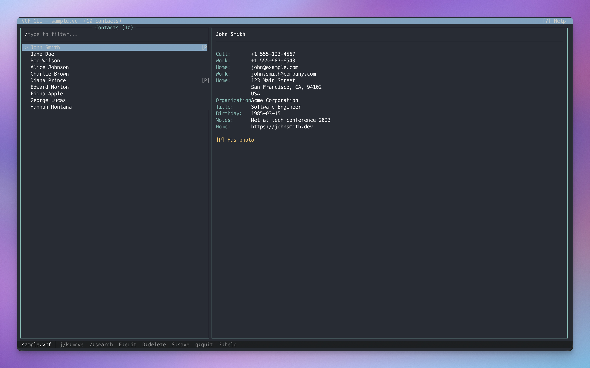

# VCF CLI

A terminal UI for browsing, editing, and cleaning up VCF (vCard) contact files.

Built for managing large contact exports from Apple Contacts before importing elsewhere.




## Features

- **Split-pane interface** — contact list + detail view side by side
- **Vim-style navigation** — `j`/`k`, `gg`/`G`, `Ctrl+d`/`Ctrl+u`
- **Live search** — filter by name, email, phone, or organization
- **Edit contacts** — modify name, phone, email, org inline
- **Delete with confirmation** — clean up unwanted contacts
- **Auto-backup** — timestamped `.bak` files on every save
- **Large file support** — handles 1000+ contacts efficiently

## Installation

```bash
git clone https://github.com/youruser/vcf-cli.git
cd vcf-cli
bundle install
```

## Usage

```bash
# Run with any VCF file
bundle exec bin/vcf-cli contacts.vcf

# Or put your files in the data/ directory (gitignored)
bundle exec bin/vcf-cli data/my-contacts.vcf
```

## Keybindings

| Key | Action |
|-----|--------|
| `j` / `↓` | Move down |
| `k` / `↑` | Move up |
| `gg` | Go to top |
| `G` | Go to bottom |
| `Ctrl+d` | Page down |
| `Ctrl+u` | Page up |
| `/` | Search/filter |
| `Esc` | Clear search |
| `E` | Edit contact |
| `D` | Delete contact |
| `S` | Save changes |
| `q` | Quit |
| `?` | Help |

## Interface

The split-pane interface shows your contact list on the left and details on the right.

- `[P]` indicates contacts with embedded photos
- The status bar shows available keybindings
- Filter results update live as you type

## Supported vCard Versions

- vCard 3.0 (Apple Contacts default)
- vCard 2.1 (legacy)
- vCard 4.0

## Backups

When you save, VCF CLI automatically creates a backup:

```
contacts.vcf.20231215_143022.bak
```

The last 5 backups are kept; older ones are automatically deleted.

## Development

```bash
# Run tests
bundle exec rspec

# Debug mode
DEBUG=1 bundle exec bin/vcf-cli contacts.vcf
```

## License

MIT
